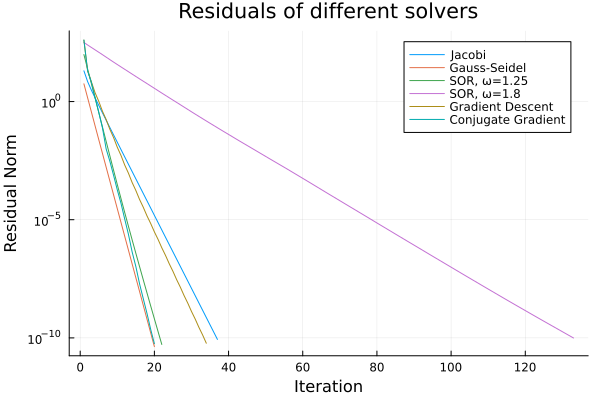
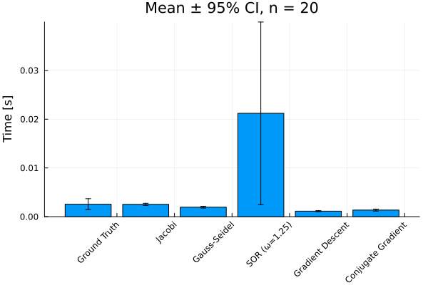

# Assignment 2

## Exercise 4

### Residuals

As expected, the Conjugate Gradient method performs the best, resulting in the lowest normalized residual.

The different solvers can be split into 3 groups of similar performance.

- Group 1: Conjugate Gradient, Gauss-Seidel and SOR ($\omega = 1.25$)
- Group 2: Gradient Descent and Jacobi
- Group 3: SOR ($\omega = 1.8$)

Group 3 (SOR  with $\omega = 1.8$) method performed notably bad. It took about 110 iterations to meet the required criterion ($\epsilon = 1e-10$). The first group iterated about 20 times while Group 2 had an average of about 36 iterations.

### Runtimes

The SOR methods performed the worst. This may be partly due to the fact that with $\omega = 1.8$, the method does up to 90 iterations more than the best methods. Since SOR with $\omega = 1.25$ also takes only about 20 iterations, this cannot explain all differences. The confidence intervals are extremely large however, so these measurements need to be viewed with a grain of salt.

All other methods take approximately the same amount of time. The ground truth solver is the slowest of the other methods with the largest confidence interval. The Gradient Descent method is the fastest method with a really small confidence interval.
