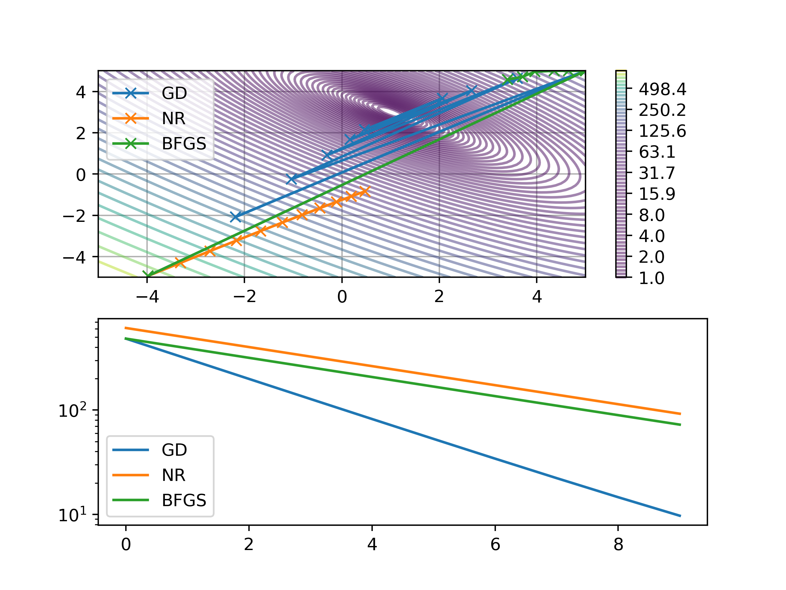
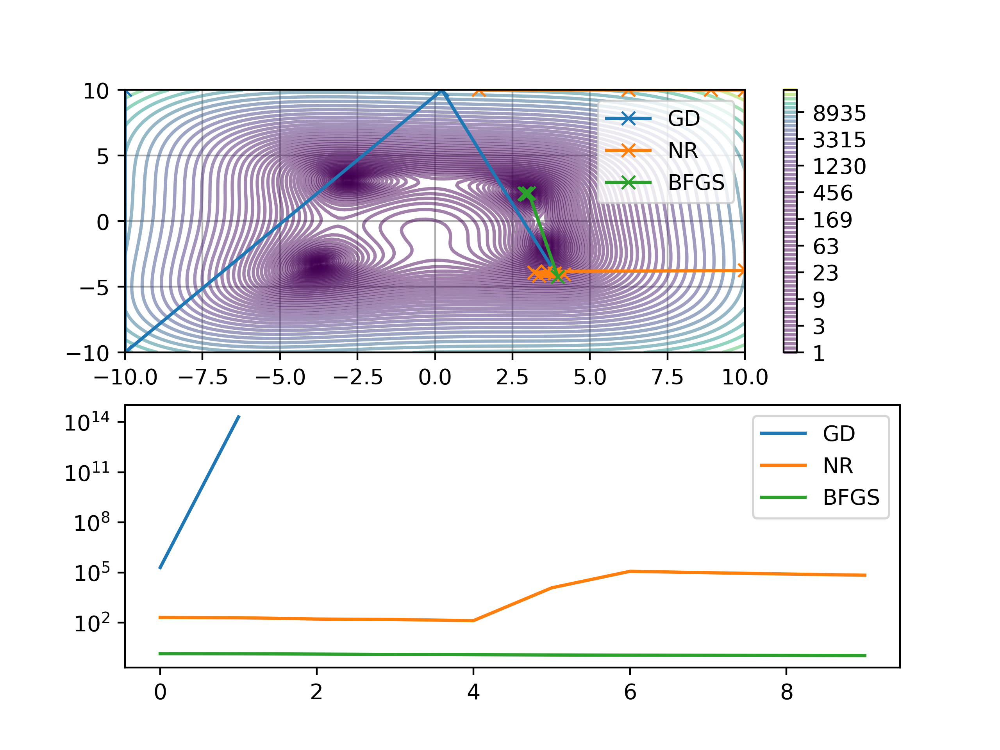
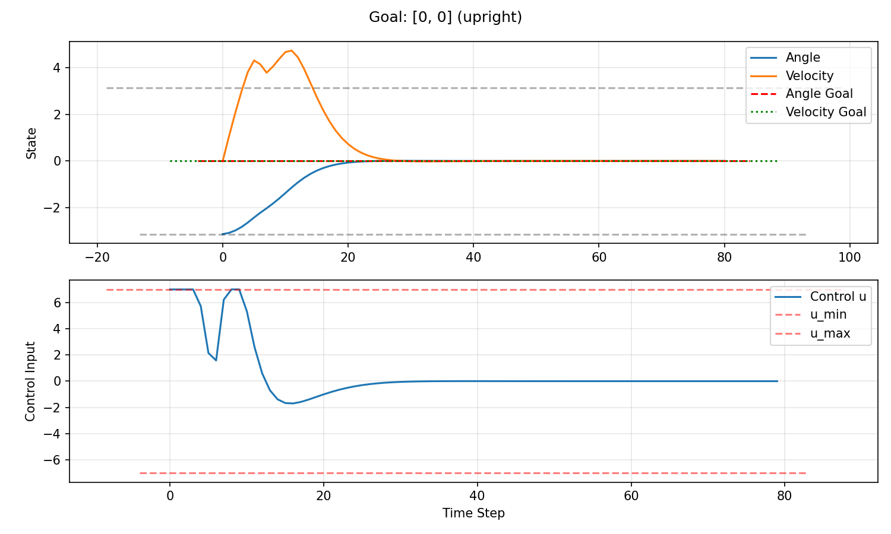
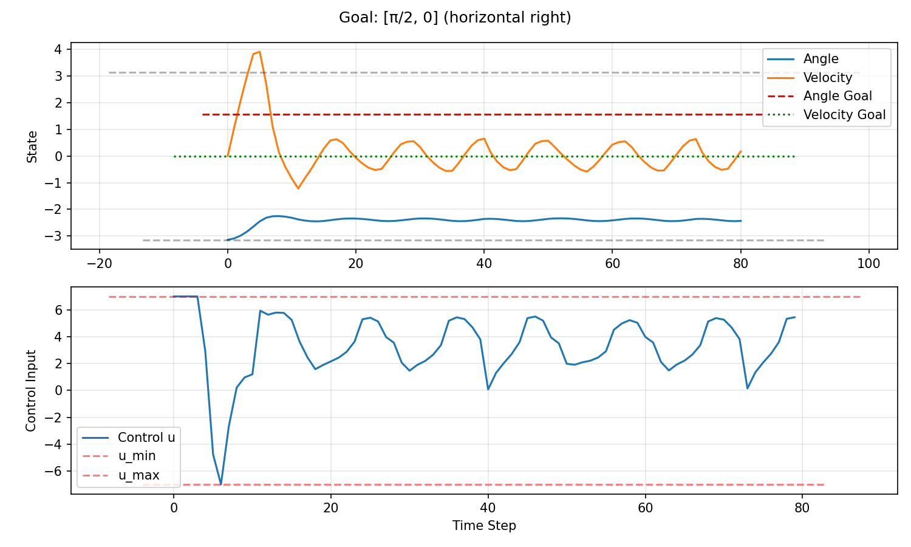
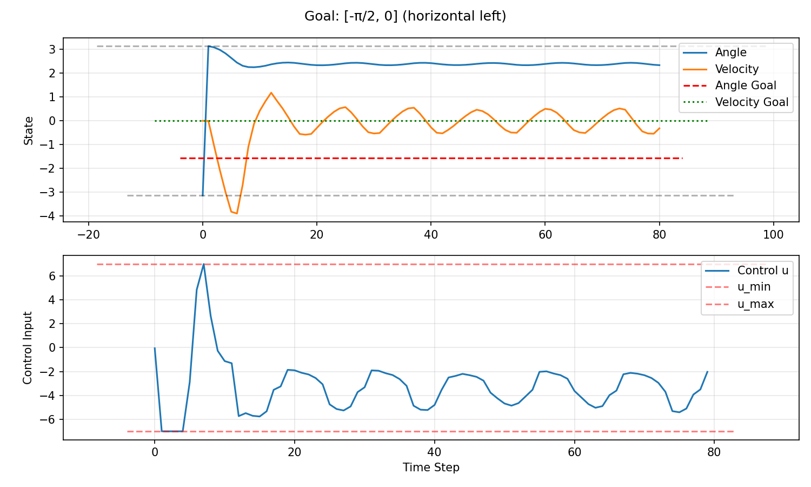
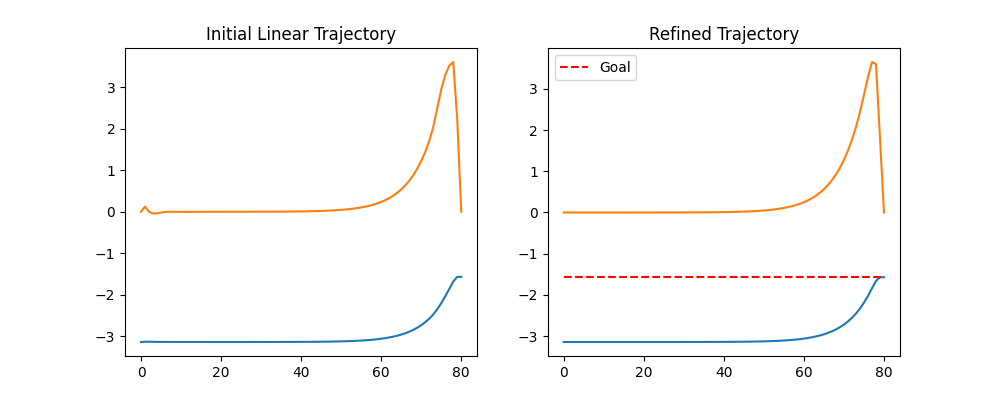

# Optimization Assignment 2

## Exercise 1





```python
def yourfunction(xy):
    x, y = jnp.split(xy.flatten(), 2, axis=0)
    (val,) = jnp.sin(x) * jnp.cos(y) + (x - y) ** 2
    return val + 1.0

```

## Exercise 3

### Part 2

#### Results for Three Goal Positions

**Goal 1: [0, 0] (upright position)**


**Goal 2: [π/2, 0] (horizontal right)**


**Goal 3: [-π/2, 0] (horizontal left)**


### Part 3

**Results:**
The method converges in about 6 iterations. The initial guess (linearized around $x_0$) is often dynamically infeasible for the real system when far from $x_0$. The refined trajectory respects the nonlinear dynamics much better.

**Refinement Plot:**

